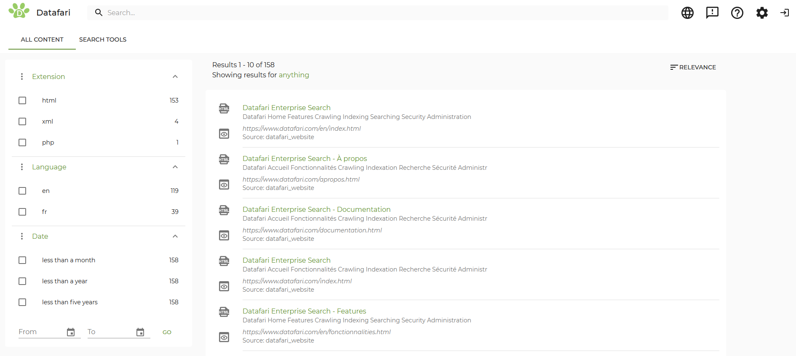
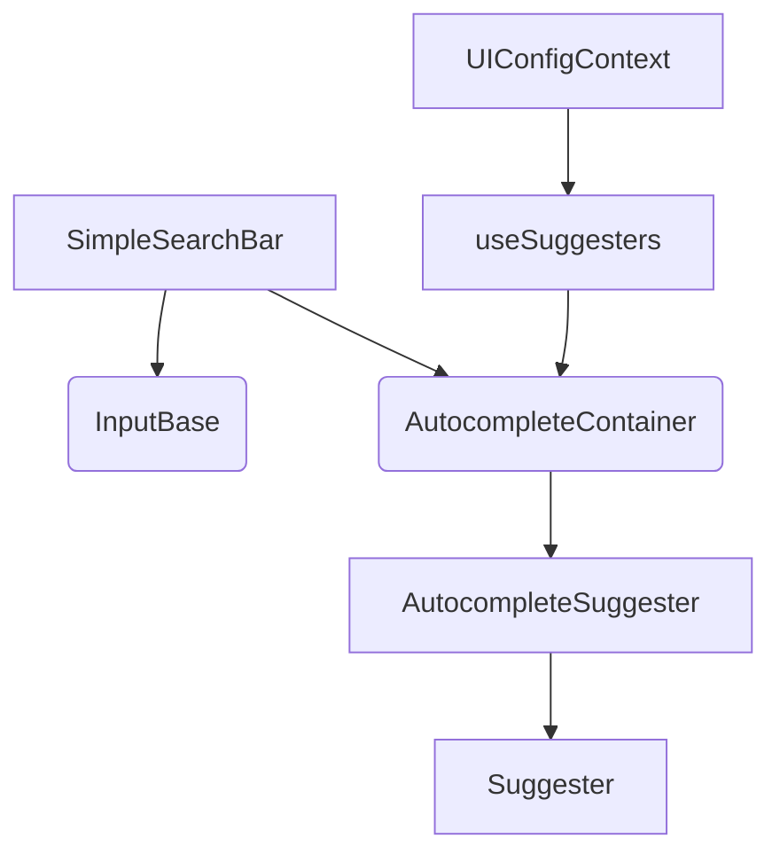

# React app to develop your search interface to be used with Datafari

## Contents

- [About Datafari UI](#about-datafari-ui)

- [Getting started](#getting-started)

- [Creating a search experience](#creating-a-search-experience)

- [Contribute](#contribute)

- [License](#license-)

---

## About Datafari UI

A **[React](https://reactjs.org)** app bootstraped using **[create react app](https://github.com/facebook/create-react-app)** and using

**[MaterialUI](https://material-ui.com/)** that allows you to quickly implement search experiences to couple with **[Datafari](https://www.datafari.com/)**.

### Features

- **By Datafari, for Datafari** - Maintained by [France Labs](https://www.francelabs.com/), the team behind [Datafari](https://www.datafari.com/).

- **Speedy Implementation** - Build a complete search experience with a few lines of code.

- **Customizable** - Tune the components, markup, styles, and behaviors to your liking.



## Getting started

Before trying to modify anything, you can try building the React application and deploy it wherever you want, to have you first own UI for Datafari.

To do so you will need to perform the following steps:

1. Install an instance of Datafari on a server or VM of yours

2. Install [nodejs](https://nodejs.org/en/) (together with its packet manager npm) to build the React app

3. Clone the [datafariui repository](https://github.com/francelabs/DatafariUI) and configure the React app to work with your environment

4. Build the React app

5. Deploy the React app on a web server

### Install an instance of Datafari

You will first need to install an instance of the last version of Datafari using the [documentation](https://datafari.atlassian.net/wiki/spaces/DATAFARI/overview).

### Install nodejs on the machine you plan to build the React app on

You can build the project on any machine (your local machine, a VM, anything) but you will need nodejs to run the build.

Install it from your OS package manager or follow the instructions on the [nodejs](https://nodejs.org/en/) website.

### Clone the datafariui repository and configure the app for you environment

Clone the [datafariui repository](https://github.com/francelabs/DatafariUI)

```sh

git clone https://github.com/francelabs/DatafariUI.git

```

We will suppose that our datafari instance is deployed at myhost.test.com and uses the default deployment parameters used when following the documentation.

We will suppose that we want to deploy datafariui at myuihost.test.com/datafariui.

Open the file `src/index.js` and change the line declaring the datafariBaseURL to match the base URL of your Datafari instance

(it should end in /Datafari if you have followed the documentation for the installation):

```js
window.datafariBaseURL = new URL("https://myhost.test.com/Datafari");
```

In the file `.env.production` change the PUBLIC_URL variable to match the path you will be using to access Datafari UI on the server you will deploy it to.

By default, it is set to /datafariui which means the UI is accessed through a URL like this: `https://myuihost.test.com/datafariui`.

If you want to use another path, you must change this variable. It can be set to `/` it you deploy the app at the root of a domain.

In our exemple, we do not need to change it:

```

PUBLIC_URL=/datafariui

```

### Build the React App

You can now build the application, to do so first install all the dependencies and then build the app by running the following commands:

```sh

npm install

# Wait for the install process to download all the dependencies and then

npm run build

```

### Deploy the React app on a web server

Once the process is finished, you can take the content of the build directory and copy it to the root folder of a web server you want to deploy your Datafari UI to.

Any URL that does not correspond to an existing file should be redirected to the index.html file.

A possible Directory configuration when using Apache2 as the web server is the following (considering that we copied the content of the build directory of the project to the folder /opt/datafari/www of our server):

```apache

<Directory "/opt/datafari/www">

Require all granted

Options -MultiViews

RewriteEngine On

RewriteBase "/datafariui/"

RewriteCond %{REQUEST_FILENAME} !-f

RewriteRule "^" "index.html" [QSA,L]

</Directory>

```

Note that the rewrite rule is set to serve the directory under `/datafariui`. If you want to serve the UI under another path, change all instances of `/datafariui/` by the same path you set in the PUBLIC_URL variable earlier.

You then also need to setup a virtual host or an Alias directive to serve the directory. Please refer to the Apache2 documentation for that.

If you are using another web server or have difficulties configuring it, search the documentation about deploying React applications created with create react app.

For reference, here is an excerpt of the configuration we use for testing to give you an idea, but it is not guarenteed to work as is for you:

```apache

<VirtualHost *:80>

ServerName myuihost.test.com

Redirect / https://myuihost.test.com/

CustomLog /dev/null common

Header set X-Frame-Options SAMEORIGIN

</VirtualHost>


<VirtualHost *:443>

ServerName myuihost.test.com

ServerAdmin postmaster@myuihost.test.com

Header set X-Frame-Options SAMEORIGIN


RedirectMatch ^/$ /datafriui


Alias /datafariui /opt/datafari/www/

<Directory "/opt/datafari/www">

Require all granted

Options -MultiViews

RewriteEngine On

RewriteBase "/datafariui/"

RewriteCond %{REQUEST_FILENAME} !-f

RewriteRule "^" "index.html" [QSA,L]

</Directory>


SSLEngine on

SSLCertificateFile /opt/ssl-keystore/apache/mycert.crt

SSLCertificateKeyFile /opt/ssl-keystore/apache/mycert.key


CustomLog /var/apache/logs/customLogApache.log common

ErrorLog /var/apache/logs/errorApache.log


</VirtualHost>

```

Once all of this is done, you should be able to use the default UI proposed by DatafariUI at https://myuihost.test.com/datafariui

## Creating a search experience

DatafariUI comes with a default interface that you are free to update and modify as you need.

You can update only the theme (colors, font), logos and parameters of certain components or dive deeper and add new components or change the look and feel of existing ones.

This section will give you information about how to do this.

### Modifying the themes and logos

DatafariUI relies on the [MaterialUI](https://material-ui.com/) library for the development of its components as well as the theming.

Therefore you can easily change the font, the accent colors or any other color or spacing property quite easily from only one file: `src/App.js`.

Within this file you will find at the begining the definition of the default theme:

```jsx
const defaultTheme = createMuiTheme({
  overrides: {
    MuiFilledInput: {
      root: {
        backgroundColor: "#fafafa",
      },
    },
  },

  typography: {
    fontFamily: "montserrat, Helvetica, Arial, sans-serif",
  },

  palette: {
    primary: {
      light: "#ffffff",

      main: "#ffffff",

      dark: "#fafafa",
    },

    secondary: {
      light: "#99cc33",

      main: "#679439",

      dark: "#648542",
    },
  },
});
```

The primary palette is used for most of the background colors whereas the secondary main color is the accent color (the green by default) you will find in various places of the interface (including hyperlinks). A lighter and a darker versions are defined for use where necessary.

The typography section also defines the font used in the interface.

The overrides section at the top allows to modify the default background color used in input fields for the default theme; we used it because it did not suit us.

Feel free to have a look at the [MaterialUI documentation](https://material-ui.com/customization/theming/) about theming for more details on what can be changed here.

### Changing components parameters or adding elements

DatafariUI tries to take advantage of the components based approach proposed by React, making it easier to add / remove elements from the interface.

We will provide a quick rundown of the project structure for you to have a better understanding of where things are. Then we will provide you with more information about the key things you will probably want to customize.

### Project structure

The project structure is pretty simple.

If you are not familiar with React, the hooks (`src/Hooks`) are sets of helper functions that provide a functionality that can be easily reused in several places of the app.

The contexts (`src/Contexts`) are sets of variables that can be accessed throughout the application.

This is a very simple way of seeing and understanding things, yet there is more to it and we encourage you to read more about them if you want to modify the existing ones / create your owns.

We will not modify or even use those in this section. Menus are defined as components, so you might want to modify them here if you want to change menu items.

Singular components are defined in the `src/Components` folder.

They take advanteage of the tools provided in hooks (`src/Hooks`) and variables provided in the contexts (`src/Contexts`) to provide simple reusable components.

They are made to be used in any places of the UI.

The `src/Pages` folders gather all the different interfaces defined in DatafariUI. It regroups all pages as well as all the modals you can see in the interface.

They use the Components and place them on the page to form usable interfaces.

This is where most of your customization will happen.

### Facets

The central interface in DatafariUI is the search page, which is defined in `src/Pages/Search/Search.js`.

This is where you will define which facets are added to the side panel for exemple.

Query and Field facets are both defined as Components and can be used simply. You will find some examples in the `src/Pages/Search/Search.js` file.

### Search Bar

The search bar is managed by components defined under `src/Components/SimpleSearchBar` folder.
SimpleSearchBar is the main component that defines a input search with a list of suggesters. Suggester are predefined in `src/Hook/useSuggester` hook. At this time, there is 3 mains suggesters available :

- `BASIC` : basic suggester based on words
- `ENTITY` : suggester based on entities like authors names
- `CUSTOM` : suggester based on user custom search

#### SimpleSearchBar Composition



`AutocompleteContainer` uses `useSuggesters` hook to render each one with `AutocompleteSuggester`.

Suggesters are configured via `ui-config.json` file, located into the root of DatafariUI public folder. From it, suggesters can be added/removed and configured. This configuration can be access via `UIConfigContext`

When starting a search, each suggester will perform its request to get suggestions. They are displayed under the search bar into their respective section, one for each. User can navigate through with the keyboard arrows. Each navigation with arrows will update the input search bar value with the selected suggestion. Press `Enter` to perform a search or click directly on a suggestion.

Here an exemple of suggesters configuration :

```json
  ...
  "searchBar": {
    "suggesters": [
      {
        "type": "BASIC",
        "props": {
          "maxSuggestion": 5,
          "title": "SUGGESTED QUERIES",
          "subtitle": "Queries extending your current query terms",
        },
      },
      {
        "type": "ENTITY",
        "props": {
          "field": "authorTokens",
          "suggester": "suggestAuthors",
          "dictionary": "suggesterEntityAuthors",
          "asFacet": false,
          "maxSuggestion": 5,
          "title": "Entities suggested",
          "subtitle": "Queries extending your current query terms"
        }
      }
    ]
  }
  ...
```

Suggester types are limited to : `BASIC`, `ENTITY` and `CUSTOM`.
For each one, you can configured props :

- Some fields are mandatory to perform suggestion request
- `maxSuggestion` defined the number of results displayed in suggestions
- `title` Key name for translation of the title suggester section
- `subtitle` Key name for translation of the subtitle suggester section

It is allowed to use multiple suggesters of the same **type** like 2 ENTITY suggesters on different fields. Each will appear on different section.

#### Add new suggester configuration

In the configuration below, we have 3 suggesters : 1 basic et 2 entities.
The 2 entities suggesters differ on the field. Title/subtitle can be different as well.

```json
  ...
  "searchBar": {
    "suggesters": [
      {
        "type": "BASIC",
        "props": {
          "maxSuggestion": 5,
          "title": "SUGGESTED QUERIES",
          "subtitle": "Queries extending your current query terms",
        },
      },
      {
        "type": "ENTITY",
        "props": {
          "field": "authorTokens",
          "suggester": "suggestAuthors",
          "dictionary": "suggesterEntityAuthors",
          "asFacet": false,
          "maxSuggestion": 5,
          "title": "Entities suggested",
          "subtitle": "Queries extending your current query terms"
        }
      },
      {
        "type": "ENTITY",
        "props": {
          "field": "authorSocialSecurityNumber",
          "suggester": "suggestAuthors",
          "dictionary": "suggesterEntityAuthors",
          "asFacet": false,
          "maxSuggestion": 5,
          "title": "Entities suggested by social security number",
          "subtitle": "Queries extending your current query terms"
        }
      }
    ]
  }
  ...
```

#### Add new type suggester

When adding a new type of suggester, we need to implement it in React and rebuild DatafariUI.

To do it, following these steps :

1. Implement a new hook with the same structure as other hooks implemented yet like `useBasicAutocomplete.js`. This hook needs to have at least, a `querySuggestions` function, a `suggestions` array for results, a `onSelect` function to return the real value to display in the search bar, `title` and `subtitle` as string to name the autocomplete section.
2. in `useSuggester.js`, add a new suggester type and export it :

```jsx
export const NEW_TYPE = "myNewTypeSuggester";
```

Then add the new suggester hook in the array `definedSuggester` :

```jsx
const [definedSuggesters] = useState([
  {
    type: BASIC_ID,
    suggester: useBasicAutocomplete,
  },

  {
    type: ENTITY_ID,
    suggester: useEntityAutocomplete,
  },

  {
    type: CUSTOM_ID,
    suggester: useCustomSuggesterAutocomplete,
  },
  {
    type: NEW_TYPE,
    suggester: useNewTypeSuggesterAutocomplete,
  },
]);
```

3. Finally, add this new type in the `ui-config.json` file :

```json
...
searchBar: {
    suggesters: [
      {
        type: "BASIC",
        props: {
          maxSuggestion: 5,
          title: "SUGGESTED QUERIES",
          subtitle: "Queries extending your current query terms",
        },
      },
      {
        type: "ENTITY",
        props: {
          field: "authorTokens",
          suggester: "suggestAuthors",
          dictionary: "suggesterEntityAuthors",
          asFacet: false,
          maxSuggestion: 5,
          title: "Entities suggested",
          subtitle: "Queries extending your current query terms",
        },
      },
      {
        type: "NEW_TYPE",
        props: {
          field: "newField",
          suggester: "newSuggester",
          dictionary: "newDictionary",
          asFacet: false,
          maxSuggestion: 5,
          title: "New suggestions",
          subtitle: "Queries extending your current query terms",
        },
      }
    ],
  },
  ...
```

Adapt props to your new type. All fields will be pass as props to the new type suggester.

### Search Tabs

The UI configuration allows to add some tabs below the search bar, between the All content tab and the Advance search tab.

So far, it exists two kinds of tab :

- `FieldFacet` : it will create tabs as much as a field from result query. Example with "extension" field, it will create tabs as mush as extensions returned in the results query (pdf, doc, ppt, etc).
  This tab takes two parameters :
  `field` : the field name to match with tabs
  `max`: the max number of tab to create

- `Raw` : Raw tab is just a link to an defined URL. It takes 2 parameters :
  `label` : label of the tab or key for i18n
  `url`: an HTTP URL. The link is opened into a new navigator tab.
  `target` (optional, default is `_self`): Define HTML target to open the url

These tabs can be added as below in the ui-config.json, in the center property

```json
"center": {
    "main": [
      {
        "type": "SearchInformation",
        "data": ["filters", "facets"],
      },
      {
        "type": "ResultsList",
        "data": ["title", "url", "logo", "previewButton", "extract"],
      }
    ],
    "tabs": [
      { "type": "FieldFacet", "field": "extension", "max": 3 },
      { "type": "FieldFacet", "field": "repo_source", "max": 3 },
      { "type": "Raw", "label": "google", "url": "https://www.google.fr" },
      { "type": "Raw", "label": "LinkedIn", "url": "https://www.linkedin.com", "target": "_blank" }
    ]
  },
```

### Search results display

The display of results is managed by the components defined in the `src/Components/ResultsList` folder.

The `ResultEntry` component defines how a single result is displayed while the `ResultList` component defines how the list of entries is displayed. You can modify those to change which properties of the results are shown or the way results are displayed to suits your preferences.

### Logo

The logo displayed in the top left corner is an SVG file that must be changed in the app before building it.

The file to change is `src/Icons/top_left_logo.svg`.

## Contribute

Here are some information to help you create new UI components, including communication with the backend.

To explain how things are connected together and how to integrate a new functionality, i will use the already implemented Favorite feature.

This feature allows a user to:

- mark/unmark documents as favorites in the results page

- see if a document is a favorite or not from the results page

This feature requires communicating with the Datafari backend to:

- Get the list of favorites documents for the current user

- Add a document to the favorites list

- Remove a document from the favorites list

To implement this feature we will do several things:

- Define the URL to the endpoint(s) we need to access from Datafari API in the APIEndpointsContext

- Create a Hook that will manage all the interactions with the backend and provide components with helper functions and states variables to work with

- Create a component to show if a document is bookmarked or not in the results list and allow to mark/unmark a document as favorite

- Integrate this component in the results list

- Create a modal page to display the list of results

If you go through the code, you will see some features that we do not address in this documentation:

- get access to a modal showing the list of documents he has marked as favorite

- The favorite feature elements are only displayed if the favorite feature is active on the backend

### Defining the URL to the required Datafari API endpoints

All Datafari API endpoints are defined in the `APIEndpointsContext` (`src/Contexts/api-endpoints-context.js`).

For detailed information about contexts, please refer to the React documentation. But to make it simple, they allow

to share variables accross components without the need to pass them through props everytime.

Here we need to query the current user favorite endpoint that is accessible via the address `{DATAFARI_REST_API_BASE_URL}/users/current/favorites`.

It supports the following HTTP verbs that are important to us:

- GET to get the list of favorites

- POST to add a favorite

- DELETE to remove a favorite

We do not need to define any other endpoint for the set of features we want to support.

To add this endpoint to the context we will need to add at two places in the `src/Contexts/api-endpoints-context.js`;

First near the top, in the definition of the DEFAULT_ENDPOINTS variable from line 3 we need to add:

```js

currentUserFavoritesURL: '',

```

This declaration allows the autocomplete feature of our IDE to know the variable exists in the object and helps us in our development.

It also ensures that the property is defined even though its value is not known yet.

As we need some helper variables to create the URL, we cannot set it to a fixed value here.

Then the creation of the URL is to be done in the creation of the state variable value in the UseState statement begining around line 47.

This variable contains the creation of all the URLs.

You will find somewhere the creation of the URL we need which looks like the following:

```js

currentUserFavoritesURL: new  URL(

`${restAPIBaseURL.pathname}/users/current/favorites`,

restAPIBaseURL

),

```

You can see we use here the variable `restAPIBaseURL` to create our URL. This is a special variable pointing to the base of the REST API of the Datafari backend we should refer to. This varaible in turns uses the `DatafariBaseURL` variable to define itself. The DatafariBaseURL is built from the `window.datafariBaseURL` defined in the `src/index.js` file we talked about in the Getting Started section.

Proceeding this way ensures that all URLs are refering to the same Datafari backends and simplifies the definition of a new backend if need be.

Now that our endpoint URL is defined, we can create a hook. The components will use it to access the current user favorites funcitonalities.

### Creating the useFavorites hook

The goal for this hook is to provide components with helper functions to perform actions on the favorites (get, create, delete) and some

state variable providing the state and responses from the backend.

Unsurprisingly, this hook uses the `APIEndpointsContext` to access the API endpoint URL we defined earlier.

But it also uses the `useHTTP` hook, which is a helper to perform HTTP requests and get the responses.

```js
const { isLoading, data, error, sendRequest, reqIdentifier } = useHttp();

const apiEndpointsContext = useContext(APIEndpointsContext);
```

Here is the usage of the variables from useHTTP:

- `isLoading` is a boolean state variable telling if a request is in progress or not

- `data` is an object state variable that holds the body of the response once the request is done

- `error` is an object state variable holding information if any error occurs during the request

- `sendRequest` is a helper function to send a request, we are detailing its usage below

- `reqIdentifier` is the identifier of the request for which other variables are set at a given moment (in case several requests are done using a single useHTTP hook, although we do not recommend sending several requests in parallel; i.e. avoid sending a new request if the previous one has not completed).

The `sendRequest` function is used as shown below:

```

sendRequest(url, method, body, reqIdentifier, headers)

```

- `url` is a URL objecct providing the URL to which the request must be sent

- `method` is a string giving the HTTP verb to use ('GET', 'POST', ...)

- `body` is the body of the query, can be null if not needed

- `reqIdentifier` is a String to identify the request in state updates, will be used to set the the reqIdentifier state variable when updating other state variables

- `headers` is an object to define specific headers if needed. It is optional and can be ommitted or set to null.

Given those informations, we can implement the core functionalities needed for our favorites features.

```js
const getFavorites = useCallback(
  (queryID) => {
    sendRequest(
      `${apiEndpointsContext.currentUserFavoritesURL}`,

      "GET",

      null,

      queryID
    );
  },

  [apiEndpointsContext.currentUserFavoritesURL, sendRequest]
);

const addFavorite = useCallback(
  (queryID, docID, docTitle) => {
    const favorite = {
      id: docID,

      title: docTitle,
    };

    sendRequest(
      `${apiEndpointsContext.currentUserFavoritesURL}`,

      "POST",

      JSON.stringify(favorite),

      queryID
    );
  },

  [apiEndpointsContext.currentUserFavoritesURL, sendRequest]
);

const removeFavorite = useCallback(
  (queryID, docID) => {
    const body = {
      id: docID,
    };

    sendRequest(
      `${apiEndpointsContext.currentUserFavoritesURL}`,

      "DELETE",

      JSON.stringify(body),

      queryID
    );
  },

  [apiEndpointsContext.currentUserFavoritesURL, sendRequest]
);
```

The useCallback function ensures that our functions are not recreated on each rerender of the components using the the `useFavorites` hook.

The functions are recreated only if the dependencies change, in this case `apiEndpointsContext.currentUserFavoritesURL` and `sendRequest`, which are constant.

This optimizes the rerenders cycles.

Beside that, the three functions are pretty simple, they take as argument the required elements, a `queryID` to identify the query and send the request.

Updates do not need to be managed as the `useHTTP` hook takes care of updating `isLoading`, `data` etc.

Components will need to take care of returned errors and responses.

Once these functions are created, they are returned by the hook as well as the necessary state functions embedded into objects that represents the output of the hook:

```js
return {
  getFavorites: getFavorites,

  addFavorite: addFavorite,

  removeFavorite: removeFavorite,

  getFavoritesStatus: getFavoritesStatus,

  isLoading: isLoading,

  data: data,

  error: error,

  reqIdentifier: reqIdentifier,
};
```

This return statement holds the "public" part of the hook, that can be accessed and called from the components using the hook.

Keep in mind that everytime a component uses a hook, a new instance of the hook is created. Those are not made to share data.

Please refer to the React documentation for more information about hooks.

We now have a hook ready to be used, let us implement a component to show if a document is a favorite or not.

### Showing favorites in the results list

We want each result in the results list to display an icon stating if they are bookmarked as favorite or not by the user.

This icon must be clickable to change the bookmarked status of the corresponding result.

To do so, we need to have access to the favorites list and check if the current result is in this list.

We already have a `ResultsList` component displaying the list of ressults through `ResultEntry` components.

Two main options are available to us:

- Using the favorites hook inside the `ResultEntry` component, get the list of favorites there and build the logic there (we can even create a new component that is used inside the `ResultEntry` component)

- Using the favorites hook inside the `ResultsList` component and pass as props to the `ResultEntry` component the required information about the favorite state of the results (is it a favorite, a function to call to change the state)

The first solution provides a nice separation of concerns and allows to manage the favorite status in a dedicated component, however it means that for earch result displayed, the list of favorites will be querried to the backend and processed in the React app.

This represents way too much queries. Therefore, we chose to use the second approach. In this case, the list of favorites is queried once and the `ResultsList` component transmits as props the required elements to the ResultEntry component.

First of all, let us tackle the modifications in the `ResultsList` component.

We need to get an instance of the `useFavorites` hook within our component definition like so:

```js
const {
  isLoading,

  data,

  error,

  reqIdentifier,

  getFavorites,

  addFavorite,

  removeFavorite,

  getFavoritesStatus,
} = useFavorites();
```

Then we need a place to store the list of favorites once we received it, this will be stored in a state.

We will also use a state to store some information about the queries we make.

```js
const [favorites, setFavorites] = useState([]);

const [fetchQueryID, setFetchQueryID] = useState(null);

const [modifQueries, setModifQueries] = useState([]);
```

Then we need to retrieve the list of favorites. To do so, we will use the `useEffect` hook that allows to run a function uppon certain circumstances:

```js
useEffect(() => {
  if (results.results) {
    let newQueryID = Math.random().toString(36).substring(2, 15);

    setFetchQueryID(newQueryID);

    getFavorites(
      newQueryID,

      results.results.map((result) => result.id)
    );
  }
}, [results.results, getFavorites, setFetchQueryID]);
```

In this case whenever the `results.results`, `getFavorites` or `setFetchQueryID` variable changes, the function is run.

Practically speaking, only `results.results` should ever change, the others are there for completeness and to abide to React best practices.

This means that whenever a new set of results arrives, we run the function, and as the core of the function shows, if the set of results is not null, we fetch the favorites using a randomly generated query ID.

So far so good, but we now need to handle the responses from the request when they arrive. They arrive in the form of updates to the `isLoading`, `data` and `error` state variable from the `useFavorites`.

To catch such changes, another `useEffect` hook usage will be used:

```js
useEffect(() => {
  if (!isLoading && !error && data && reqIdentifier === fetchQueryID) {
    if (data.status === "OK") {
      setFavorites(data.content.favorites.map((favorite) => favorite.id));
    }
  }
}, [data, error, isLoading, fetchQueryID, reqIdentifier, setFavorites]);
```

Here, any modification of one of the variables: `data`, `error`, `isLoading`, `fetchQueryID`, `reqIdentifier`, `fetchQueryID` will trigger the effect.

The effect then checks if `reqIdentifier` corresponds to the identifier we created randomly before, if the query is done and if there are no errors.

In this case, it sets up the `favorites` state using the content of the response, keeping only the id of the favorites as this is all we need here.

We now have enough information to tell if a result is bookmarked or not.

We only need to check if the id of a result is in the list of favorites id we retrieved from the server.

We now need to pass that information along to the `ResultEntry` component.

To do so, we will add a prop to the `ResultEntry` component holding this information:

```js
<ResultEntry
  {...result}
  position={results.start + index}
  bookmarkEnabled={favoritesEnabled}
  bookmarked={favorites.indexOf(result.id) !== -1}
  folderLinkSources={folderLinkSources}
/>
```

Among the other props that this component already requires, you can see that we added the `bookmarked` prop to hold the information about the status of this document as a favorite.

We can now enrich the `ResultEntry` component to take advantage of that and show a bookmark badge for each result, empty if the result is not bookmarked, full if it is:

```js
<ListItemSecondaryAction className={classes.bookmarkAction}>
  <IconButton edge="end" aria-label="bookmark">
    {props.bookmarked ? <BookmarkIcon /> : <BookmarkBorderIcon />}
  </IconButton>
</ListItemSecondaryAction>
```

Now we have the bookmark status displayed but we still need to be able to update it when the user clicks on the bookmark badge.

To do so, we need to perform a request to the backend when the icon is clicked.

The `useFavorite` hook is instanciated within the `ResultsList` component, and the `ResultsList` component is responsible for

managing the favorites list, therefore it seems legitimate to create the callback functions for the clicks here and pass them

as props to the `ResultEntry` component.

We need two functions: one for adding a result as favorite, one for removing.

```js
const addFavoriteCallback = useCallback(
  (favoriteID, favoriteTitle) => {
    return () => {
      setModifQueries((currentQueries) => {
        const newQueries = { ...currentQueries };

        newQueries[favoriteID] = "add";

        return newQueries;
      });

      addFavorite(favoriteID, favoriteID, favoriteTitle);
    };
  },

  [setModifQueries, addFavorite]
);

const removeFavoriteCallback = useCallback(
  (favoriteID) => {
    return () => {
      setModifQueries((currentQueries) => {
        const newQueries = { ...currentQueries };

        newQueries[favoriteID] = "remove";

        return newQueries;
      });

      removeFavorite(favoriteID, favoriteID);
    };
  },

  [setModifQueries, removeFavorite]
);
```

Those are functions that return a callback function parameterized using the provided parameters (the ID of the result and its title in the case of an creation request).

The callback functions send the necessary query to the backend using the corresponding helper functions from the `useFavorites` hook.

But before that, they update the state variable holding the list of requests currently in progress to modify the favorites list (adding or removing).

We store there the id of the request, set to the id of the document, as well as the action being done (add of remove).

As seen before, we have sent request, we now need to handle the changes in the state corresponding to the reception of a response and to handle that.

This will be again done using useEffect:

```js
useEffect(() => {
  if (modifQueries[reqIdentifier]) {
    if (!isLoading && !error && data) {
      if (data.code === 0 || data.status === "OK") {
        setFavorites((currentFavorites) => {
          if (modifQueries[reqIdentifier] === "add") {
            return currentFavorites.concat(reqIdentifier);
          } else {
            return currentFavorites.filter((docID) => docID !== reqIdentifier);
          }
        });

        setModifQueries((currentQueries) => {
          const newQueries = { ...currentQueries };

          newQueries[reqIdentifier] = undefined;

          delete newQueries[reqIdentifier];

          return newQueries;
        });
      }
    }
  }
}, [
  data,

  error,

  isLoading,

  reqIdentifier,

  setFavorites,

  modifQueries,

  setModifQueries,
]);
```

Note that there is no problem having several separate effects tied to the same state variables.

Here again we use the `data`, `error`, `isLoading` and `reqIdentifier` variables.

The first thing done is to check if the `reqIdentifier` is one corresponding to a modification request registered in `modifQueries`.

If this is the case, the list of favorites is updated by adding or removing the corresponding document id from the list of favorites.

This update in the state variable will trigger a rerender that will update the displayed `ResultEntry` components if their props have changed.

For now, this never happens as the callbacks functions are never used.

Let us add them as props to the `ResultEntry` component:

```js
<ResultEntry
  {...result}
  position={results.start + index}
  bookmarkEnabled={favoritesEnabled}
  bookmarked={favorites.indexOf(result.id) !== -1}
  bookmarkClickCallback={
    favorites.indexOf(result.id) !== -1
      ? removeFavoriteCallback(result.id)
      : addFavoriteCallback(
          result.id,

          Array.isArray(result.title) ? result.title[0] : result.title
        )
  }
  folderLinkSources={folderLinkSources}
/>
```

Depending on whether the result is bookmarked or not, the callback passed is the one to create or delete a favorite.

We will now update our `ResultEntry` component to use this click callback function on our button:

```js
<ListItemSecondaryAction className={classes.bookmarkAction}>
  <IconButton
    edge="end"
    aria-label="bookmark"
    onClick={props.bookmarkClickCallback}
  >
    {props.bookmarked ? <BookmarkIcon /> : <BookmarkBorderIcon />}
  </IconButton>
</ListItemSecondaryAction>
```

And we are done, we have implemented the feature we wanted for the favorites in the results list.

The actual code contains a little bit more than that as it also checks out if the user is authenticated and if the feature is

activated in the backend before displaying anything.

Have a look at the code for the `FavoritesModal` (`src/Pages/FavoritesModal/FavoritesModal.js`) for more exemple on the usage of the

`useFavorites` hook. You can also have a look at how alerts are managed for another code exemple, it follows the same rules of creating

an endpoint URL, a hook, and use the hook in components in combination to effects (`useEffect`) to handle responses.

### useHotkey hook

This hook allows to define hotkey with one command key plus an optional second letter key.
Command key are defined as below (case sensitive) :

- shift
- alt
- ctrl
- escape

  These commands keys are defined into `src/Hooks/useHotkey.js`. Use exported cmd keys ID in other components.

These command keys can be associated with another key like any alphanumeric key, to provide hotkey under the form : `[CMD_key+second_key]` such as `[ctrl+k]`, `[shift+S]` etc.

`useHotkey` hook can be used anywhere in the react application. Exemple of use :

```jsx
import { CTRL } from "src/Hooks/useHotkey";

const { hotkey: ctrlHotkey } = useHotkey({
  cmd: CTRL,
  key: "D",
  enable: true,
  callback: handleHotkey,
});
```

The hook take 3 parameters :

- `cmd` : Command key, one of defined command keys in the useHotkey js file
- `key` (optional, default value to "") : Second key of the hotkey.
- `enable` (optional, default is false) : True to enable the hotkey. False otherwise. In this last case, empty string will be returned
- `callback` : Called if command key matched and either the second key matched or it equals to empty string

The hook returns a component that represents the hotkey. You can mount it wherever you want in your component. By default, this component displays the hotkey between `[]` like `[⇧S]`.

###Hotkeys configuration
Hotkeys can be configured into `ui-config.json` file, like below ;

```json
"hotkeys": {
    "activeSearchBar": {
      "cmd": "shift",
      "key": "S",
      "enable": false
    },
    "deactiveSearchBar": {
      "cmd": "escape",
      "enable": false
    }
  }
```

Be care, cmd and key are case sensitive. If you use `shift` as command, the key MUST be in <strong>CAPITAL</strong>.

Hotkeys IDs are defined into the `useHotkey.js` (`activeSearchBar`, `deactiveSearchBar`, ...). Defined here other IDs to increase the list of hotkeys available.

### ResultsList configuration

In the `ui-config.json`, you have some optional parameters :

- `folderLinkSources` : array of sources to open as a folder. Default is empty array
- `folderTarget` (default is `_blank`): target to open folder. Values are the same than the HTML attribute `target`
- `previewTarget` (default `_self`): target to open preview page. Values are the same than the HTML attribute `target`.

```json
{
  "type": "ResultsList",
  "data": ["title", "url", "logo", "previewButton", "extract"],
  "folderLinkSources": [],
  "folderTarget": "_blank",
  "previewTarget": "_self"
}
```

## License 📗

[Apache-2.0](https://github.com/elastic/search-ui/blob/master/LICENSE.txt) © [France Labs](https://www.francelabs.com/)
